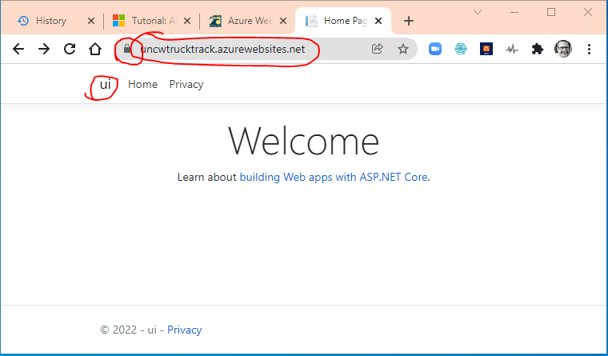

# Azure Deploy Commands

I am following the documentation here:

[Tutorial: Build an ASP.NET Core and Azure SQL Database app in Azure App Service](https://docs.microsoft.com/en-us/azure/app-service/tutorial-dotnetcore-sqldb-app?toc=%2Faspnet%2Fcore%2Ftoc.json&bc=%2Faspnet%2Fcore%2Fbreadcrumb%2Ftoc.json&view=aspnetcore-5.0&pivots=platform-linux)

* I installed the Azure Account extension in VS Code, which prompted me to install nodejs also
* in VSCode I went to View | Command Palette then started typing Azure
* I chose "Azure: Open Bash in Cloud Shell"
* this first prompted me to log in to azure via a web page, from then on, VSCode remembered my login for me
* this then gave me a prompt that looked like: douglaskline@Azure:~$
* I can now type commands that start with "az" to make things happen in my Azure account

these commands are all typed at the azure command line

```shell
$ az webapp deployment user set --user-name trucktrackwebapp --password *******
{
  "id": null,  
  "kind": null,
  "name": "web",
  "publishingPassword": null,
  "publishingPasswordHash": null,
  "publishingPasswordHashSalt": null,
  "publishingUserName": "trucktrackwebapp",
  "scmUri": null,
  "systemData": null,
  "type": "Microsoft.Web/publishingUsers/web"
}

douglaskline@Azure:~$ az appservice plan create --name trucktrackServicePlan --resource-group UNCWStuff --sku FREE --is-linux
{
  "freeOfferExpirationTime": null,
  "geoRegion": "East US 2",
  "hostingEnvironmentProfile": null,
  "hyperV": false,
  "id": "/subscriptions/1dbc0b68-8c0b-4685-a182-f8ade7670730/resourceGroups/UNCWStuff/providers/Microsoft.Web/serverfarms/trucktrackServicePlan",       
  "isSpot": false,
  "isXenon": false,
  "kind": "linux",
  "location": "eastus2",
  "maximumElasticWorkerCount": 1,
  "maximumNumberOfWorkers": 0,
  "name": "trucktrackServicePlan",
  "numberOfSites": 0,
  "perSiteScaling": false,
  "provisioningState": "Succeeded",
  "reserved": true,
  "resourceGroup": "UNCWStuff",
  "sku": {
    "capabilities": null,
    "capacity": 1,
    "family": "U",
    "locations": null,
    "name": "U13",
    "size": "U13",
    "skuCapacity": null,
    "tier": "LinuxFree"
  },
  "spotExpirationTime": null,
  "status": "Ready",
  "subscription": "1dbc0b68-8c0b-4685-a182-f8ade7670730",
  "systemData": null,
  "tags": null,
  "targetWorkerCount": 0,
  "targetWorkerSizeId": 0,
  "type": "Microsoft.Web/serverfarms",
  "workerTierName": null
}

douglaskline@Azure:~$ az webapp create --resource-group UNCWStuff --plan trucktrackServicePlan --name uncwtrucktrack --runtime 'DOTNET|5.0' --deployment-local-git

Local git is configured with url of 'https://trucktrackwebapp@uncwtrucktrack.scm.azurewebsites.net/uncwtrucktrack.git'
{
  "availabilityState": "Normal",
  "clientAffinityEnabled": true,
  "clientCertEnabled": false,
  "clientCertExclusionPaths": null,
  "clientCertMode": "Required",
  "cloningInfo": null,
  "containerSize": 0,
  "customDomainVerificationId": "9FE064560125C866574E8EF3E6A25A04C43DFB3208785EA13F927432DC8E6F89",
  "dailyMemoryTimeQuota": 0,
  "defaultHostName": "uncwtrucktrack.azurewebsites.net",
  "deploymentLocalGitUrl": "https://trucktrackwebapp@uncwtrucktrack.scm.azurewebsites.net/uncwtrucktrack.git",
  "enabled": true,
  "enabledHostNames": [
    "uncwtrucktrack.azurewebsites.net",
    "uncwtrucktrack.scm.azurewebsites.net"
  ],
  "ftpPublishingUrl": "ftp://waws-prod-bn1-135.ftp.azurewebsites.windows.net/site/wwwroot",
  "hostNameSslStates": [
    {
      "hostType": "Standard",
      "ipBasedSslResult": null,
      "ipBasedSslState": "NotConfigured",
      "name": "uncwtrucktrack.azurewebsites.net",
      "sslState": "Disabled",
      "thumbprint": null,
      "toUpdate": null,
      "toUpdateIpBasedSsl": null,
      "virtualIp": null
    },
    {
      "hostType": "Repository",
      "ipBasedSslResult": null,
      "ipBasedSslState": "NotConfigured",
      "name": "uncwtrucktrack.scm.azurewebsites.net",
      "sslState": "Disabled",
      "thumbprint": null,
      "toUpdate": null,
      "toUpdateIpBasedSsl": null,
      "virtualIp": null
    }
  ],
  "hostNames": [
    "uncwtrucktrack.azurewebsites.net"
  ],
  "hostNamesDisabled": false,
  "hostingEnvironmentProfile": null,
  "httpsOnly": false,
  "hyperV": false,
  "id": "/subscriptions/1dbc0b68-8c0b-4685-a182-f8ade7670730/resourceGroups/UNCWStuff/providers/Microsoft.Web/sites/uncwtrucktrack",
  "identity": null,
  "inProgressOperationId": null,
  "isDefaultContainer": null,
  "isXenon": false,
  "kind": "app,linux",
  "lastModifiedTimeUtc": "2022-02-01T18:34:25.593333",
  "location": "East US 2",
  "maxNumberOfWorkers": null,
  "name": "uncwtrucktrack",
  "outboundIpAddresses": "20.75.47.56,20.75.47.57,20.75.47.96,20.75.47.97,20.75.47.110,20.75.47.111,20.49.97.31",
  "possibleOutboundIpAddresses": "20.75.47.56,20.75.47.57,20.75.47.96,20.75.47.97,20.75.47.110,20.75.47.111,20.75.47.130,20.75.47.131,20.75.47.135,20.75.47.146,20.75.47.147,20.75.47.148,20.75.47.164,20.75.96.101,20.75.97.6,20.75.97.160,20.75.97.242,20.75.99.159,20.75.11.94,20.75.11.216,20.75.13.67,20.75.14.133,20.75.14.243,20.75.15.57,20.49.97.31",
  "redundancyMode": "None",
  "repositorySiteName": "uncwtrucktrack",
  "reserved": true,
  "resourceGroup": "UNCWStuff",
  "scmSiteAlsoStopped": false,
  "serverFarmId": "/subscriptions/1dbc0b68-8c0b-4685-a182-f8ade7670730/resourceGroups/UNCWStuff/providers/Microsoft.Web/serverfarms/trucktrackServicePlan",
  "siteConfig": {
    "acrUseManagedIdentityCreds": false,
    "acrUserManagedIdentityId": null,
    "alwaysOn": false,
    "antivirusScanEnabled": null,
    "apiDefinition": null,
    "apiManagementConfig": null,
    "appCommandLine": null,
    "appSettings": null,
    "autoHealEnabled": null,
    "autoHealRules": null,
    "autoSwapSlotName": null,
    "azureMonitorLogCategories": null,
    "azureStorageAccounts": null,
    "connectionStrings": null,
    "cors": null,
    "customAppPoolIdentityAdminState": null,
    "customAppPoolIdentityTenantState": null,
    "defaultDocuments": null,
    "detailedErrorLoggingEnabled": null,
    "documentRoot": null,
    "experiments": null,
    "fileChangeAuditEnabled": null,
    "ftpsState": null,
    "functionAppScaleLimit": 0,
    "functionsRuntimeScaleMonitoringEnabled": null,
    "handlerMappings": null,
    "healthCheckPath": null,
    "http20Enabled": false,
    "http20ProxyFlag": null,
    "httpLoggingEnabled": null,
    "ipSecurityRestrictions": [
      {
        "action": "Allow",
        "description": "Allow all access",
        "headers": null,
        "ipAddress": "Any",
        "name": "Allow all",
        "priority": 1,
        "subnetMask": null,
        "subnetTrafficTag": null,
        "tag": null,
        "vnetSubnetResourceId": null,
        "vnetTrafficTag": null
      }
    ],
    "javaContainer": null,
    "javaContainerVersion": null,
    "javaVersion": null,
    "keyVaultReferenceIdentity": null,
    "limits": null,
    "linuxFxVersion": "",
    "loadBalancing": null,
    "localMySqlEnabled": null,
    "logsDirectorySizeLimit": null,
    "machineKey": null,
    "managedPipelineMode": null,
    "managedServiceIdentityId": null,
    "metadata": null,
    "minTlsVersion": null,
    "minimumElasticInstanceCount": 0,
    "netFrameworkVersion": null,
    "nodeVersion": null,
    "numberOfWorkers": 1,
    "phpVersion": null,
    "powerShellVersion": null,
    "preWarmedInstanceCount": null,
    "publicNetworkAccess": null,
    "publishingPassword": null,
    "publishingUsername": null,
    "push": null,
    "pythonVersion": null,
    "remoteDebuggingEnabled": null,
    "remoteDebuggingVersion": null,
    "requestTracingEnabled": null,
    "requestTracingExpirationTime": null,
    "routingRules": null,
    "runtimeADUser": null,
    "runtimeADUserPassword": null,
    "scmIpSecurityRestrictions": [
      {
        "action": "Allow",
        "description": "Allow all access",
        "headers": null,
        "ipAddress": "Any",
        "name": "Allow all",
        "priority": 1,
        "subnetMask": null,
        "subnetTrafficTag": null,
        "tag": null,
        "vnetSubnetResourceId": null,
        "vnetTrafficTag": null
      }
    ],
    "scmIpSecurityRestrictionsUseMain": null,
    "scmMinTlsVersion": null,
    "scmType": null,
    "sitePort": null,
    "tracingOptions": null,
    "use32BitWorkerProcess": null,
    "virtualApplications": null,
    "vnetName": null,
    "vnetPrivatePortsCount": null,
    "vnetRouteAllEnabled": null,
    "webSocketsEnabled": null,
    "websiteTimeZone": null,
    "winAuthAdminState": null,
    "winAuthTenantState": null,
    "windowsFxVersion": null,
    "xManagedServiceIdentityId": null
  },
  "slotSwapStatus": null,
  "state": "Running",
  "suspendedTill": null,
  "systemData": null,
  "tags": null,
  "targetSwapSlot": null,
  "trafficManagerHostNames": null,
  "type": "Microsoft.Web/sites",
  "usageState": "Normal"
}

douglaskline@Azure:~$ az webapp config connection-string set --resource-group UNCWStuff --name uncwtrucktrack --settings MyDbConnection='********' --connection-string-type SQLAzure
{
  "MyDbConnection": {
    "type": "SQLAzure",
    "value": "**********"
  }
}

# now push to azure from git
# starting fresh on a new day, so az cloud shell not connected in VS Code
# from command palette, choose Azure: Open Bash in Cloud Shell

az webapp config appsettings set --name uncwtrucktrack --resource-group UNCWStuff --settings DEPLOYMENT_BRANCH='main'
[
  {
    "name": "DEPLOYMENT_BRANCH",
    "slotSetting": false,
    "value": "main"
  }
]

# add an Azure remote to the local Git repo

# this command is in the local git bash terminal
git remote add azure https://trucktrackwebapp@uncwtrucktrack.scm.azurewebsites.net/uncwtrucktrack.git

# this command is in the local git bash terminal
# check to see what the remotes are - is Azure there?
git remote
azure
origin

#still in the local git bash terminal

git push azure main
# I get prompted for the password created in the deployment user set at the top of this document
# then I get all this:

Enumerating objects: 562, done.
Counting objects: 100% (562/562), done.
Delta compression using up to 16 threads
Compressing objects: 100% (407/407), done.
Writing objects: 100% (562/562), 849.94 KiB | 5.59 MiB/s, done.
Total 562 (delta 211), reused 304 (delta 117), pack-reused 0
remote: Resolving deltas: 100% (211/211), done.
remote: Deploy Async
remote: Updating branch 'main'.
remote: Updating submodules.
remote: Preparing deployment for commit id '1e9cbb1343'.
remote: Repository path is /home/site/repository
remote: Running oryx build...
remote: Operation performed by Microsoft Oryx, https://github.com/Microsoft/Oryx
remote: You can report issues at https://github.com/Microsoft/Oryx/issues
remote:
remote: Oryx Version: 0.2.20210826.1, Commit: f8651349d0c78259bb199593b526450568c2f94a, ReleaseTagName: 20210826.1
remote:
remote: Build Operation ID: |k+pkwoPHOhk=.bdbbf7b_
remote: Repository Commit : 1e9cbb134311a2bb8ae418cb65a125bb07bba843
remote:
remote: Detecting platforms...
remote: Detected following platforms:
remote:   dotnet: 5.0.12
remote: Version '5.0.12' of platform 'dotnet' is not installed. Generating script to install it...
remote: 
remote: Using intermediate directory '/tmp/8d9e663990ca22b'.
remote: 
remote: Copying files to the intermediate directory...
remote: Done in 2 sec(s).
remote: 
remote: Source directory     : /tmp/8d9e663990ca22b
remote: Destination directory: /home/site/wwwroot
remote: 
remote: 
remote: Downloading and extracting 'dotnet' version '5.0.403' to '/tmp/oryx/platforms/dotnet/5.0.403'...
remote: Downloaded in 3 sec(s).
remote: Verifying checksum...
remote: Extracting contents...
remote: .......
remote: Done in 16 sec(s).
remote: 
remote: 
remote: Using .NET Core SDK Version: 5.0.403
remote: 
remote: Welcome to .NET 5.0!
remote: ---------------------
remote: SDK Version: 5.0.403
remote: 
remote: Telemetry
remote: ---------
remote: The .NET tools collect usage data in order to help us improve your experience. It is collected by Microsoft and shared with the community. You can opt-out of telemetry by setting the DOTNET_CLI_TELEMETRY_OPTOUT environment variable to '1' or 'true' using your favorite shell.
remote: 
remote: Read more about .NET CLI Tools telemetry: https://aka.ms/dotnet-cli-telemetry
remote: 
remote: ----------------
remote: Installed an ASP.NET Core HTTPS development certificate.
remote: To trust the certificate run 'dotnet dev-certs https --trust' (Windows and macOS only).
remote: Learn about HTTPS: https://aka.ms/dotnet-https
remote: ----------------
remote: Write your first app: https://aka.ms/dotnet-hello-world
remote: Find out what's new: https://aka.ms/dotnet-whats-new
remote: Explore documentation: https://aka.ms/dotnet-docs
remote: Report issues and find source on GitHub: https://github.com/dotnet/core
remote: Use 'dotnet --help' to see available commands or visit: https://aka.ms/dotnet-cli
remote: --------------------------------------------------------------------------------------
remote:   Determining projects to restore...
remote: .......................
remote:   Restored /tmp/8d9e663990ca22b/trucktrack/dal/dal.csproj (in 26.86 sec).
remote:   Restored /tmp/8d9e663990ca22b/trucktrack/ui/ui.csproj (in 29.7 sec).
remote:
remote: Publishing to directory /home/site/wwwroot...
remote:
remote: Microsoft (R) Build Engine version 16.11.2+f32259642 for .NET
remote: Copyright (C) Microsoft Corporation. All rights reserved.
remote:
remote:   Determining projects to restore...
remote:   All projects are up-to-date for restore.
remote: ..
remote:   dal -> /tmp/8d9e663990ca22b/trucktrack/dal/bin/Release/net5.0/dal.dll
remote: .....
remote:   ui -> /tmp/8d9e663990ca22b/trucktrack/ui/bin/Release/net5.0/ui.dll
remote:   ui -> /tmp/8d9e663990ca22b/trucktrack/ui/bin/Release/net5.0/ui.Views.dll
remote: .
remote:   ui -> /home/site/wwwroot/
remote: Preparing output...
remote: 
remote: Removing existing manifest file
remote: Creating a manifest file...
remote: Manifest file created.
remote: 
remote: Done in 78 sec(s).
remote: Running post deployment command(s)...
remote: Triggering recycle (preview mode disabled).
remote: Deployment successful.
remote: Deployment Logs : 'https://uncwtrucktrack.scm.azurewebsites.net/jsonviewer?view_url=/api/deployments/1e9cbb134311a2bb8ae418cb65a125bb07bba843/log'
To https://uncwtrucktrack.scm.azurewebsites.net/uncwtrucktrack.git
 * [new branch]      main -> main


```

## the moment of truth

open up chrome and go to: [url of app in azure](https://uncwtrucktrack.azurewebsites.net/)

this works, and gives me:



Now try to go to:[user part of app](https://uncwtrucktrack.azurewebsites.net/user)

this does not work, and gives me:


## Next Step

I think the issue now is that the SQL Server connection string is not known to the webapp. I think it needs to be added as an environment variable in Azure. So when the app wakes up, it says "what environment am I in", and the answer 