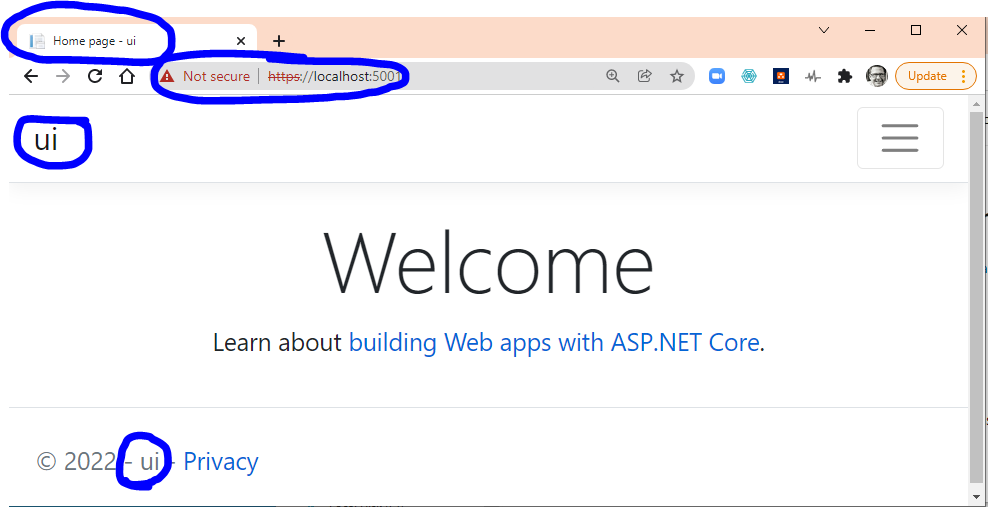

# Initial Scaffold Commands

These are the commands that were used to create the initial scaffolded projects.

## Setup the root project

``` shell
\trucktrackrepo> dotnet new sln -o trucktrack

# makes a new folder called trucktrack
# makes a file in that folder called trucktrack.sln

\trucktrackrepo>cd trucktrack
# change into the new folder

\trucktrackrepo\trucktrack>

```

## Setup the webapp project

``` shell
\trucktrackrepo\trucktrack> dotnet new mvc -o ui -f net5.0 
# creates a new folder called ui
# creates a file in the folder called ui/csproj

\trucktrackrepo\trucktrack> dotnet sln .\trucktrack.sln add .\ui\ui.csproj
# adds a reference for this project to the solution file

\trucktrackrepo\trucktrack> cd ui
# move into project folder

\trucktrackrepo\trucktrack\ui> dotnet add package Microsoft.EntityFrameworkCore --version 5.0.13
\trucktrackrepo\trucktrack\ui> dotnet add package Microsoft.EntityFrameworkCore.SqlServer --version 5.0.13
\trucktrackrepo\trucktrack\ui> dotnet add package Microsoft.EntityFrameworkCore.Design --version 5.0.13
\trucktrackrepo\trucktrack\ui> dotnet build
# last command checks to see if the whole project builds - should get "Build Succeeded" message

\trucktrackrepo\trucktrack\ui> cd ..
# move back to the solution level

\trucktrackrepo\trucktrack> dotnet new classlib -o dal -f net5.0
# new class library project for the data access layer

\trucktrackrepo\trucktrack> cd dal
\trucktrackrepo\trucktrack\dal> dotnet add package Microsoft.EntityFrameworkCore --version 5.0.13
\trucktrackrepo\trucktrack\dal> dotnet add package Microsoft.EntityFrameworkCore.SqlServer --version 5.0.13
\trucktrackrepo\trucktrack\dal> dotnet add package Microsoft.EntityFrameworkCore.Design --version 5.0.13
\trucktrackrepo\trucktrack\dal> dotnet build
# adds the packages to the dal project and checks for build

\trucktrackrepo\trucktrack> cd ..
# back out to the solution level

\trucktrackrepo\trucktrack> dotnet sln .\trucktrack.sln add .\dal\dal.csproj
# add the dal project to the solution

\\trucktrackrepo\trucktrack> cd ui
# move into the ui project directory
\trucktrackrepo\trucktrack> dotnet add reference ..\dal\dal.csproj
# add a reference to the dal project to the ui project

\\trucktrackrepo\trucktrack> cd ..
# go back to solution level directory
\\trucktrackrepo\trucktrack> dotnet build
# make sure it all compiles
# we should see build results for both the ui and dal projects

\\trucktrackrepo\trucktrack> cd ui
# move into the ui project

\\trucktrackrepo\trucktrack\ui> dotnet run
# this should show the local urls to access the basic ui project
# terminal output looks like this:

Building...
info: Microsoft.Hosting.Lifetime[0]
      Now listening on: https://localhost:5001
info: Microsoft.Hosting.Lifetime[0]
      Now listening on: http://localhost:5000
info: Microsoft.Hosting.Lifetime[0]
      Application started. Press Ctrl+C to shut down.
info: Microsoft.Hosting.Lifetime[0]
      Hosting environment: Development
info: Microsoft.Hosting.Lifetime[0]
      Content root path: C:\Users\doug\OneDrive - UNC-Wilmington\Spr2022\githubcode\trucktrackrepo\trucktrack\ui

# and accessing the url http://localhost:5000 with a browser shows this:

```

